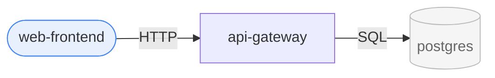

# generate-mermaid-architecture

Render the connection graph as **readable** Mermaid at several zoom levels. Stage 3 of the atlas pipeline. Readability beats completeness — a diagram nobody can read has failed even if it's "correct".

## Inputs

- `graph.json` (from detect-connections) and the `manifest.json` it references. Find them under `.atlas/`; ask if missing.

## Read these first

- [`../../references/mermaid-syntax.md`](../../references/mermaid-syntax.md) — id sanitization, label quoting, the pre-emit checklist. Run that checklist before writing any diagram so it actually renders.
- [`../../references/design-system.md`](../../references/design-system.md) — colors by role and the solid/dashed sync convention; keep these identical to the Excalidraw/Canvas outputs.

## Diagrams to produce

Write each as a `.mmd` file into `<vault>/Architecture/.atlas/diagrams/` (or `./.atlas/diagrams/`). These get embedded by `write-excalidraw` and `refresh-vault`.

### 1. System view — `system.mmd`

The whole system at a glance. `flowchart LR`.
- One node per **project**. Collapse externals: group all external nodes of the same `externalKind` is optional, but always render externals visually distinct (see styling).
- If projects have `tags` (domains), wrap each domain's projects in a `subgraph`. No tags ⇒ flat.
- **Readability budget**: aim for ≤ ~20 nodes and ≤ ~30 edges in this view. If over budget:
  - drop `import`-only edges between libs and their consumers (they add clutter); mention in note.
  - collapse low-traffic externals into a single "External Services" subgraph.
  - if still over budget, prefer domain subgraphs and say in the note that per-project views carry the detail.

### 2. Per-project neighbor views — `project.<id>.mmd`

One small diagram per project: the project + its **direct (1-hop) neighbors only**, edges labeled. This is the view that actually gets read, embedded in each project note. Always include every direct edge here (this is where completeness lives, scoped to one project).

### 3. Domain views (optional) — `domain.<tag>.mmd`

Only if the manifest uses `tags`. One diagram per domain: projects in that domain + their cross-domain edges (collapse intra-neighbor detail). Skip if there are no tags or only one domain.

## Styling conventions (apply consistently everywhere)

Colors come from [`design-system.md`](../../references/design-system.md) — use the same role→color and sync→style mapping the Excalidraw and Canvas outputs use, so all three views match.

Node shape by `kind`:
- `app` / `website` / `mobile` → `id(["Name"])` (stadium/rounded — user-facing)
- `service` / `function` → `id["Name"]` (rectangle)
- `lib` → `id[["Name"]]` (subroutine)
- `tool` → `id{{"Name"}}` (hexagon)
- `external` → `id[("Name")]` (cylinder) for db/storage, `id>("Name")` style flag or just a classDef for saas/broker

Edge style by `sync`:
- `sync` → solid arrow `-->`
- `async` → dashed arrow `-.->`

Edge label = `edge.label || edge.protocol` (optionally `+ channel`). Keep labels short.

Use a `classDef` block for color so externals are visually muted and user-facing apps pop. Example:

## Hard rules

- **One concern per diagram.** Never merge the system view and per-project detail.
- **Stable node ids.** Use the manifest project `id` as the Mermaid node id (sanitize to a valid id; keep a comment mapping if you must rename). This lets `refresh-vault` diff diagrams meaningfully.
- **Deterministic ordering.** Emit nodes and edges in a stable order (e.g. sorted by id) so regenerations produce minimal diffs.
- If you drop edges for readability, add a `%% note:` Mermaid comment saying what was omitted and where to find it. Never silently truncate.
- Before emitting each diagram, run the pre-emit checklist in [`mermaid-syntax.md`](../../references/mermaid-syntax.md) (sanitized ids, quoted labels, matched `subgraph`/`end`, one direction).

## Output & handoff

List the files written and which view is which. Next step is **write-excalidraw**, which embeds these and builds the editable canvases.
